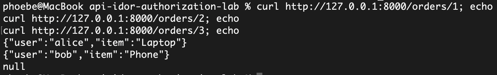
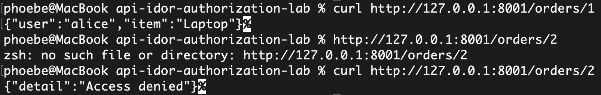

# API IDOR Authorization Lab

This project demonstrates a Broken Object Level Authorization (BOLA/IDOR) vulnerability and how proper authorization checks prevent unauthorized access to API resources.

## Project Scope

This lab includes:
- a vulnerable API
- a secure API
- IDOR/BOLA attack demonstration
- screenshots of the vulnerable and remediated behavior

## Files

- `vulnerable_api.py` — vulnerable implementation
- `secure_api.py` — remediated implementation
- `attack_demo.md` — attack summary and mitigation notes
- `screenshots/` — screenshots of test results

## Vulnerability Demonstrated

Broken Object Level Authorization (BOLA / IDOR)

The vulnerable API allows access to any order by changing the object ID in the URL, without validating ownership.

## How to Run

### Vulnerable version

```bash
python3 -m uvicorn vulnerable_api:app --reload
```

### Secure version

```bash
python3 -m uvicorn secure_api:app --reload --port 8001
```

## Security Test Results

### Vulnerable API – Unauthorized access via IDOR


### Secure API – Attack blocked
